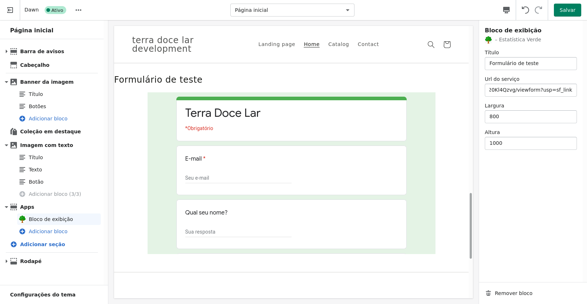
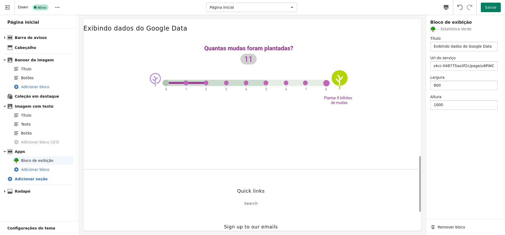

# “Estatística verde” – Solução Extra

É uma extensão para Shopify que tem como objetivo permitir a visualização de dados da ferramenta Google Data Studio e inserir formulários do Google Forms. Dessa maneira, permitindo que o usuário da Shopify possa exibir dados independente do tema utilizado em sua loja. Permitindo também maior controle sobre como essa extensão será exibida na loja. Para desenvolver essa solução bônus, precisamos lidar com a extensa documentação da Shopify, entender conceitos abstratos da plataforma e compreender a complexidade da mesma.

Lista de tecnologias utilizadas:

    • ReactJS
    • NodeJS
    • Shopify-CLI
    • Liquid template language
## Iniciando sem docker

1. install ruby
2. install ngrok
3. gem install shopify-cli
4. shopify login
5. shopify node serve
6. ngrok http 8081

## Iniciando com docker

1. install ruby
2. install ngrok
3. gem install shopify-cli
4. shopify login
5. shopify node serve
6. docker build -t <teste-helloworld> .
7. ngrok http 8081

## Requerimentos

1. ngrok
2. shopify-cli
3. NodeJs

# Imagens

### Ambiente Shopify em modo desenvolvimento no menu de customização de tema.

### Extensão em funcionamento. Nesse caso, mostrando um formulário do Google Forms que pode ser inserido na URL.

### Extensão em funcionamento. Nesse caso, exibindo dados coletados pelo Google Data que pode ser inserido na URL.

